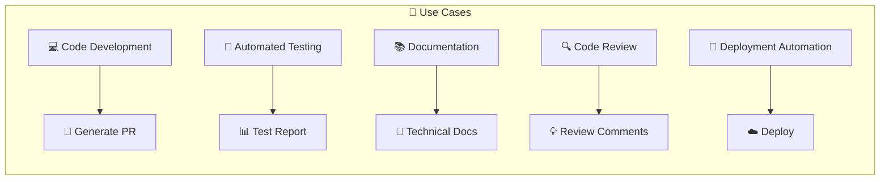
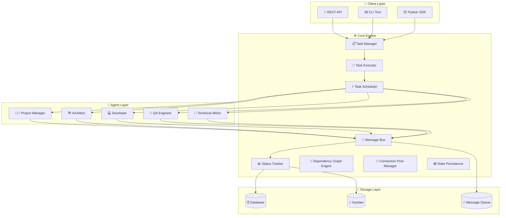
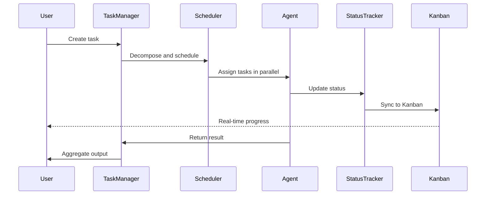
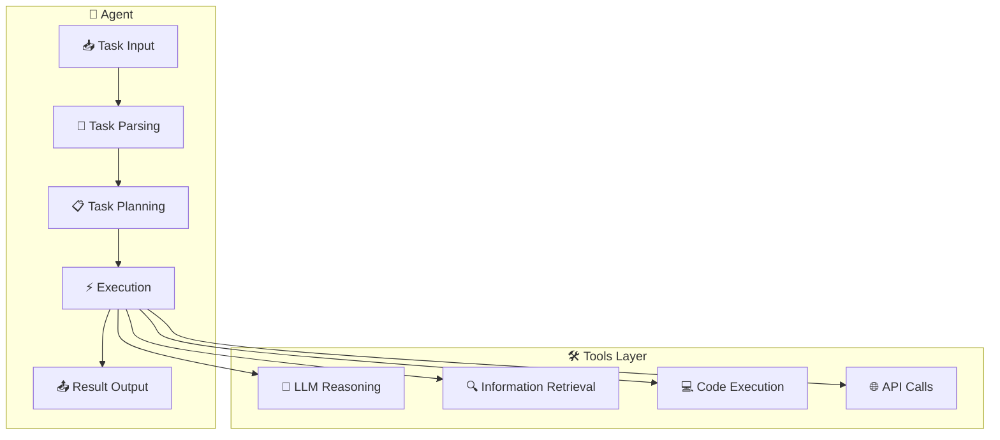

<!-- markdownlint-disable MD041 -->
<div align="center">

<picture>
  <source media="(prefers-color-scheme: dark)" srcset="https://img.shields.io/badge/🤖-AgentCrew-6366f1?style=for-the-badge&logoColor=white&labelColor=1e1e2e">
  <source media="(prefers-color-scheme: light)" srcset="https://img.shields.io/badge/🤖-AgentCrew-6366f1?style=for-the-badge&logoColor=white&labelColor=f5f5f5">
  
</picture>

# 🤖 AgentCrew | Enterprise Multi-Agent Collaboration Framework

⚡ **Intelligent Task Decomposition** · 🔄 **Parallel Execution** · 📊 **Real-time Status Tracking** · 💬 **Message Communication**

[](https://github.com/none-ai/AgentCrew/stargazers)
[
[
[
[
[
[
[
[
[
[
[
[

---

[📖 Documentation](https://github.com/none-ai/AgentCrew#-quick-start) ·
[🏗️ Architecture](https://github.com/none-ai/AgentCrew#-architecture) ·
[👥 Team Roles](https://github.com/none-ai/AgentCrew#-team-roles) ·
[🚀 Contributing](https://github.com/none-ai/AgentCrew#-contributing) ·
[💬 Discussion](https://github.com/none-ai/AgentCrew/discussions)

</div>

---

## ✨ Key Features

| Feature | Description |
|---------|-------------|
| 🤖 **Multi-Agent Collaboration** | Supports professional roles: Project Manager, Architect, Developer, QA Engineer, Technical Writer |
| 📋 **Task Management** | Intelligent task decomposition, real-time progress tracking, automatic result aggregation |
| 🔄 **Parallel Execution** | Multi-agent parallel processing, maximizing concurrency efficiency |
| 📊 **Status Tracking** | Deep integration with Kanban system, real-time task status monitoring |
| 💬 **Message Communication** | Inter-agent message passing, event notifications, pub/sub pattern |
| 🎯 **Workflow Orchestration** | Flexible workflow definition, support for conditional branches and loops |
| 🔀 **Task Dependency Graph** | DAG task dependency management, topological sorting, cycle detection |
| 🔗 **Connection Pool** | HTTP/Database/WebSocket connection pool, auto-maintenance, health checks |
| 💿 **State Persistence** | JSON/SQLite/In-memory backends, auto-save, state recovery |
| 🛡️ **Error Handling** | Agent-level and system-level error recovery mechanisms |
| 📈 **Extensibility** | Plugin architecture, easily add new agent types |
| 🔬 **Auto Research** | Automated research with trend analysis and recommendations |
| 🔄 **Self Iteration** | Automatic code improvement with auto-fix capabilities |

---

## 🎯 Use Cases



### 🏢 Enterprise Applications

- **Software Development Teams**: Automated code generation, review, testing
- **DevOps Teams**: CI/CD pipeline automation
- **Technical Documentation Teams**: Automated API documentation generation
- **QA Teams**: Automated test case generation and execution

---

## 📦 Installation

```bash
# Install via pip
pip install AgentCrew

# Or install from source
git clone https://github.com/none-ai/AgentCrew.git
cd AgentCrew
pip install -e .
```

---

## 🚀 Quick Start

```python
from AgentCrew import load_teams, get_executor, get_communication, MessageType

# 1. Load agent teams
teams = load_teams()
team = teams.get("AgentCrew_dev")

# 2. Create a task
executor = get_executor()
task = executor.create_task(
    title="Develop User Authentication Module",
    description="Implement login, registration, and permission verification",
    task_type="development"
)

# 3. Assign task
executor.assign_task(task.id, "Developer-A")

# 4. Execute task
result = executor.execute_task(task.id)

# 5. Send notification
comm = get_communication()
comm.send_message(
    sender="System",
    receiver="PM-001",
    content=f"Task {task.title} completed",
    msg_type=MessageType.NOTIFICATION
)
```

### 🔧 Advanced: Custom Agents

```python
from AgentCrew import Agent, AgentTeam

# Create custom agent
class CustomAgent(Agent):
    def __init__(self, name: str, role: str):
        super().__init__(name, role)
    
    def process(self, task):
        # Custom processing logic
        return {"status": "completed", "result": "..."}

# Create custom team
custom_team = AgentTeam(
    name="MyTeam",
    agents=[
        CustomAgent("Dev-A", "developer"),
        CustomAgent("QA-A", "qa")
    ]
)

# Use custom team
executor = get_executor()
result = executor.execute_team_task(custom_team, task)
```

---

## 🏗️ Architecture



### 🔄 System Workflow



### 🔧 Agent Internal Architecture



```
AgentCrew/
├── agents/              # Agent definitions and team management
│   └── __init__.py      # Agent, AgentTeam classes
├── tasks/              # Task definitions
├── config/             # Configuration files
├── executor.py         # Task execution engine
├── scheduler.py        # Task scheduler
├── communication.py    # Message communication module
└── data/              # Data storage
```

### Core Modules

| Module | Function |
|--------|----------|
| `agents/` | Agent role definitions, team management |
| `executor.py` | Task decomposition, execution, result aggregation |
| `scheduler.py` | Task scheduling, load balancing, parallel execution |
| `communication.py` | Message bus, pub/sub, inter-agent communication |
| `state_tracker.py` | Real-time status tracking, Kanban sync |

---

## 📊 Performance Comparison

| Metric | Serial Execution | AgentCrew Parallel | Improvement |
|--------|------------------|-------------------|-------------|
| Task Response Time | 100% | 20-40% | **60-80%** |
| Throughput | 1x | 3-5x | **300-500%** |
| Resource Utilization | 30% | 85%+ | **180%+** |

---

## 🔌 API Reference

### Core Classes

```python
# Task Executor
class TaskExecutor:
    def create_task(title, description, task_type) -> Task
    def assign_task(task_id, agent_id)
    def execute_task(task_id) -> Result
    def get_task_status(task_id) -> TaskStatus

# Message Communication
class MessageBus:
    def send_message(sender, receiver, content, msg_type)
    def subscribe(channel, callback)
    def publish(channel, message)

# Status Tracking
class StateTracker:
    def update_status(task_id, status)
    def get_progress(task_id) -> Progress
    def sync_kanban(board_id)
```

---

## 👥 Team Roles

| Role | Code | Responsibilities |
|------|------|-----------------|
| 🧑‍💼 Project Manager | pm | Task decomposition, progress tracking, result aggregation |
| 🏗️ Architect | architect | System design, tech selection, code review |
| 💻 Developer | developer | Code implementation, feature development |
| 🧪 QA Engineer | qa | Test case creation, defect discovery |
| 📝 Technical Writer | techwriter | Documentation writing |
| 🔬 Researcher | researcher | Automated research, trend analysis, market insights |
| 🔄 Optimizer | optimizer | Performance optimization, self-iteration, closed-loop improvement |

## 🤝 Contributing

Contributions welcome! Please read the [Contributing Guide](CONTRIBUTING.md).

1. Fork the project
2. Create a feature branch (`git checkout -b feature/amazing-feature`)
3. Commit your changes (`git commit -m 'Add amazing feature'`)
4. Push to the branch (`git push origin feature/amazing-feature`)
5. Open a Pull Request

## 📄 License

MIT License - see [LICENSE](LICENSE) file.

---

<div align="center">

**Created**: 2026-03-09 · **Last Updated**: 2026-03-09

[](https://github.com/none-ai/AgentCrew/stargazers)

---

### 🏢 Who Uses AgentCrew?

We welcome more developers and organizations to [share your use cases](https://github.com/none-ai/AgentCrew/discussions)!

<a href="https://github.com/stlin256" target="_blank">
  
</a>

---

### 💖 Sponsor

If you like this project, please consider sponsoring our development!

[](https://github.com/sponsors/none-ai)
[](https://buymeacoffee.com/stlin256sclaw)

---

⭐ Star us · 🍴 Fork us · 🐛 Report Issues · 💬 Discussions

Made with ❤️ by [stlin256](https://github.com/stlin256)

</div>

## 代码巡检报告 (2026-03-13)

### 发现的问题

| 类别 | 数量 | 说明 |
|------|------|------|
| import | 3 | 重复导入 |
| error_handling | 15 | bare except/try-except不匹配 |
| security | 1 | 疑似硬编码敏感信息 |
| quality | 28 | 函数过长/print语句过多/行过长 |

### 主要文件问题

- publish_queue.py: 28个print语句，1个安全问题
- persistence.py: 15个print语句
- connection_pool.py: try-except不匹配
- fast_poster.py: 重复导入，bare except

### 建议

1. 清理print语句，使用日志
2. 修复bare except
3. 审查敏感信息
4. 重构长函数
