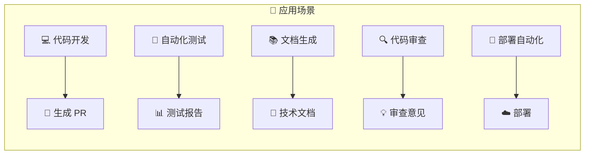
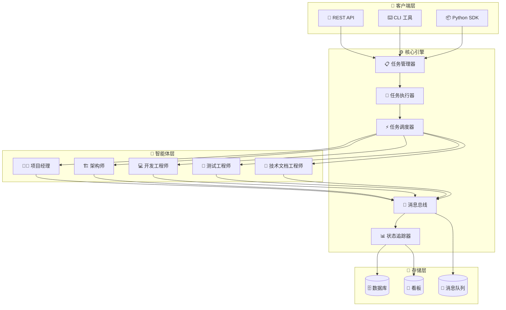
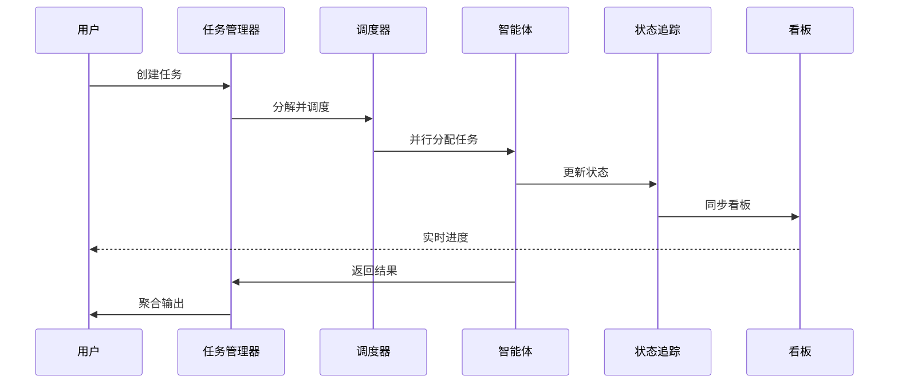
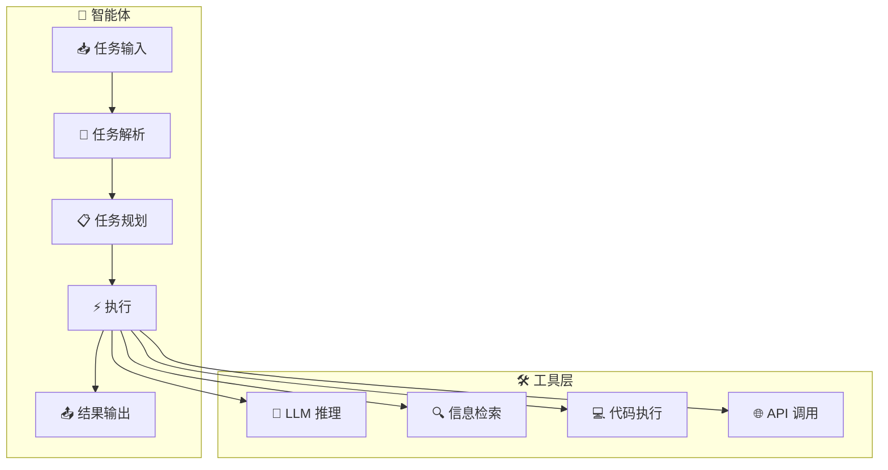

<!-- markdownlint-disable MD041 -->
<div align="center">

<picture>
  <source media="(prefers-color-scheme: dark)" srcset="https://img.shields.io/badge/🤖-AgentCrew-6366f1?style=for-the-badge&logoColor=white&labelColor=1e1e2e">
  <source media="(prefers-color-scheme: light)" srcset="https://img.shields.io/badge/🤖-AgentCrew-6366f1?style=for-the-badge&logoColor=white&labelColor=f5f5f5">
  
</picture>

# 🤖 AgentCrew | 企业级多智能体协作框架

⚡ **智能任务分解** · 🔄 **并行执行** · 📊 **实时状态追踪** · 💬 **消息通信**

[](https://github.com/none-ai/AgentCrew/stargazers)
[
[
[
[
[
[
[
[
[
[
[
[

---

[📖 文档](https://github.com/none-ai/AgentCrew#-quick-start) ·
[🏗️ 架构](https://github.com/none-ai/AgentCrew#-architecture) ·
[👥 团队角色](https://github.com/none-ai/AgentCrew#-team-roles) ·
[🚀 贡献](https://github.com/none-ai/AgentCrew#-contributing) ·
[💬 讨论](https://github.com/none-ai/AgentCrew/discussions)

</div>

---

## ✨ 核心特性

| 特性 | 描述 |
|------|------|
| 🤖 **多智能体协作** | 支持专业角色：项目经理、架构师、开发工程师、测试工程师、技术文档工程师 |
| 📋 **任务管理** | 智能任务分解、实时进度追踪、自动结果聚合 |
| 🔄 **并行执行** | 多智能体并行处理，最大化并发效率 |
| 📊 **状态追踪** | 深度集成看板系统，实时任务状态监控 |
| 💬 **消息通信** | 智能体间消息传递、事件通知、发布/订阅模式 |
| 🎯 **工作流编排** | 灵活的工作流定义，支持条件分支和循环 |
| 🛡️ **错误处理** | 智能体级和系统级错误恢复机制 |
| 📈 **可扩展性** | 插件化架构，轻松添加新的智能体类型 |

---

## 🎯 应用场景



### 🏢 企业级应用

- **软件开发团队**：自动化代码生成、审查、测试
- **DevOps 团队**：CI/CD 流程自动化
- **技术文档团队**：自动化 API 文档生成
- **QA 团队**：自动化测试用例生成与执行

---

## 📦 安装

```bash
# Install via pip
pip install AgentCrew

# Or install from source
git clone https://github.com/none-ai/AgentCrew.git
cd AgentCrew
pip install -e .
```

---

## 🚀 快速开始

```python
from AgentCrew import load_teams, get_executor, get_communication, MessageType

# 1. 加载智能体团队
teams = load_teams()
team = teams.get("AgentCrew_dev")

# 2. 创建任务
executor = get_executor()
task = executor.create_task(
    title="开发用户认证模块",
    description="实现登录、注册和权限验证功能",
    task_type="development"
)

# 3. 分配任务
executor.assign_task(task.id, "Developer-A")

# 4. 执行任务
result = executor.execute_task(task.id)

# 5. 发送通知
comm = get_communication()
comm.send_message(
    sender="System",
    receiver="PM-001",
    content=f"任务 {task.title} 已完成",
    msg_type=MessageType.NOTIFICATION
)
```

### 🔧 高级用法：自定义智能体

```python
from AgentCrew import Agent, AgentTeam

# 创建自定义智能体
class CustomAgent(Agent):
    def __init__(self, name: str, role: str):
        super().__init__(name, role)
    
    def process(self, task):
        # 自定义处理逻辑
        return {"status": "completed", "result": "..."}

# 创建自定义团队
custom_team = AgentTeam(
    name="MyTeam",
    agents=[
        CustomAgent("Dev-A", "developer"),
        CustomAgent("QA-A", "qa")
    ]
)

# 使用自定义团队
executor = get_executor()
result = executor.execute_team_task(custom_team, task)
```

---

## 🏗️ 系统架构



### 🔄 系统工作流



### 🔧 智能体内部架构



```
AgentCrew/
├── agents/              # 智能体定义和团队管理
│   └── __init__.py      # Agent, AgentTeam 类
├── tasks/              # 任务定义
├── config/             # 配置文件
├── executor.py         # 任务执行引擎
├── scheduler.py        # 任务调度器
├── communication.py    # 消息通信模块
└── data/              # 数据存储
```

### 核心模块

| 模块 | 功能 |
|------|------|
| `agents/` | 智能体角色定义、团队管理 |
| `executor.py` | 任务分解、执行、结果聚合 |
| `scheduler.py` | 任务调度、负载均衡、并行执行 |
| `communication.py` | 消息总线、发布/订阅、智能体通信 |
| `state_tracker.py` | 实时状态追踪、看板同步 |

---

## 📊 性能对比

| 指标 | 串行执行 | AgentCrew 并行 | 提升 |
|------|----------|----------------|------|
| 任务响应时间 | 100% | 20-40% | **60-80%** |
| 吞吐量 | 1x | 3-5x | **300-500%** |
| 资源利用率 | 30% | 85%+ | **180%+** |

---

## 🔌 API 参考

### 核心类

```python
# 任务执行器
class TaskExecutor:
    def create_task(title, description, task_type) -> Task
    def assign_task(task_id, agent_id)
    def execute_task(task_id) -> Result
    def get_task_status(task_id) -> TaskStatus

# 消息通信
class MessageBus:
    def send_message(sender, receiver, content, msg_type)
    def subscribe(channel, callback)
    def publish(channel, message)

# 状态追踪
class StateTracker:
    def update_status(task_id, status)
    def get_progress(task_id) -> Progress
    def sync_kanban(board_id)
```

---

## 👥 团队角色

| 角色 | 代码 | 职责 |
|------|------|------|
| 🧑‍💼 项目经理 | pm | 任务分解、进度追踪、结果聚合 |
| 🏗️ 架构师 | architect | 系统设计、技术选型、代码审查 |
| 💻 开发工程师 | developer | 代码实现、功能开发 |
| 🧪 测试工程师 | qa | 测试用例创建、缺陷发现 |
| 📝 技术文档工程师 | techwriter | 文档编写 |

## 🤝 贡献指南

欢迎提交 Pull Request！请先阅读 [贡献指南](CONTRIBUTING.md)。

1. Fork 本项目
2. 创建功能分支 (`git checkout -b feature/amazing-feature`)
3. 提交更改 (`git commit -m 'Add amazing feature'`)
4. 推送分支 (`git push origin feature/amazing-feature`)
5. 打开 Pull Request

## 📄 开源协议

本项目基于 MIT 协议开源 - 详见 [LICENSE](LICENSE) 文件。

---

<div align="center">

**创建时间**: 2026-03-09 · **最后更新**: 2026-03-09

[](https://github.com/none-ai/AgentCrew/stargazers)

---

### 🏢 谁在使用 AgentCrew？

我们欢迎更多开发者和组织 [分享你们的使用案例](https://github.com/none-ai/AgentCrew/discussions)！

<a href="https://github.com/stlin256" target="_blank">
  
</a>

---

### 💖 赞助支持

如果你喜欢这个项目，请考虑赞助我们的开发工作！

[](https://github.com/sponsors/none-ai)
[](https://buymeacoffee.com/stlin256)

---

⭐ Star us · 🍴 Fork us · 🐛 Report Issues · 💬 Discussions

Made with ❤️ by [stlin256](https://github.com/stlin256)

</div>
